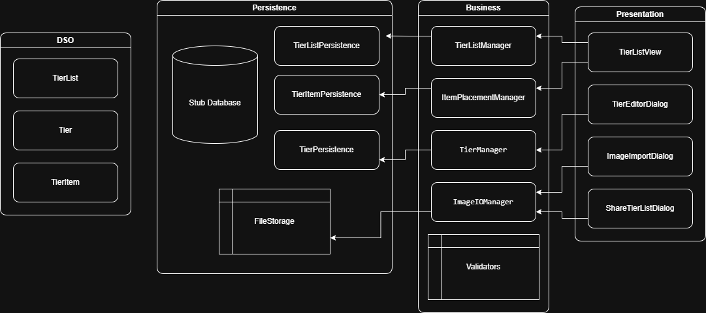

# ARCHITECTURE

This document provides an overview of the project's architecture

---

## 1. Diagram

---

## 2. Layers

### Presentation Layer

[persistence](app/src/main/java/app/TierListMakerUltimate/persistence)

**MainView**

- Class to let users interact with the tier list (starting screen of the app)

--- 

### Logic Layer

[business](app/src/main/java/app/TierListMakerUltimate/business)

**TierListManager**

- Class to modify and create TierLists

**TierManager**

- Class to modify tiers in TierLists (the structure of the TierList)

**ItemPlacementManager**

- Class to modify the positions of items in TierLists

---

#### Exceptions

[exceptions](app/src/main/java/app/TierListMakerUltimate/business/exception)

- Custom exceptions for DSO validation

---

#### Validators

[validators](app/src/main/java/app/TierListMakerUltimate/business/validation)

- For DSO validation when passing data to the business layer

---

### Domain-Specific Objects

[models](app/src/main/java/app/TierListMakerUltimate/models)

**TierList**

- Class for TierLists

**Tier**

- Class for Tiers

**TierItem**

- Class for TierItems

--- 

### Persistence Layer

[persistence](app/src/main/java/app/TierListMakerUltimate/persistence)

**TierListPersistence**

- Interface for TierLists in the database

**TierPersistence**

- Interface for Tiers in the database

**TierItemPersistence**

- Interface for TierItems in the database

---

**TierListPersistenceStub**

- Fake TierList database that uses map instead of actual relational database

**TierPersistenceStub**

- Fake Tier database that uses map instead of actual relational database

**TierItemPersistenceStub**

- Fake TierItem database that uses map instead of actual relational database

---

## 3. Component Interactions

### Dependency Flow Overview

`Presentation   →   Logic   →   Persistence   →   Database`

### Example: User Moves a TierItem

1. **User** → Drags item from "Tier S" to "Tier A"

2. **Presentation (TierListView)**
    - Listener detects drop on Tier A
    - Gets tier ID from item
    - Calls: `itemPlacementManager.moveItemToTier(itemId, targetTierId)`

4. **Logic (ItemPlacementManager)**
    - Validates: Does item exist? Does target tier exist?
    - Calls: `itemStorage.updateItem(updatedItem)`

5. **Persistence (TierItemPersistence)**
    - Queries: `UPDATE tier_items SET tier_id = ? WHERE id = ?`
    - Returns: Updated TierItem object

6. **Presentation (MainView)**
    - Call refreshUI() to reload TierList 