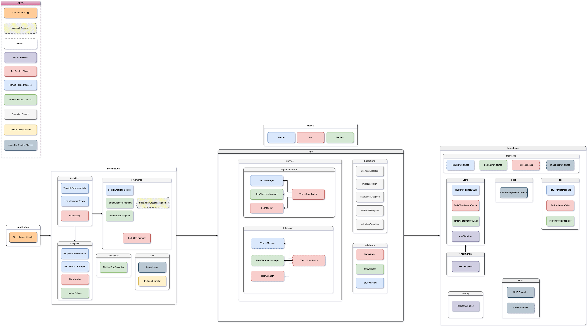

# ARCHITECTURE

This document provides an overview of the project's architecture

---

## 1. Diagram

---

## 2. Layers

### Application Layer

[application](app/src/main/java/app/TierListMakerUltimate/application)

**TierListMakerUltimate**

- The Application class that initializes all managers, persistence objects, and coordinators, making
  them available to the rest of the app.

---

### Presentation Layer

[presentation](app/src/main/java/app/TierListMakerUltimate/presentation)

**MainActivity**

- The main page where users rank items into tiers, reorder tiers, and manage items via drag and
  drop.

**TemplateBrowserActivity**

- Displays seeded and user-created templates, allowing the user to start a new tier list from a
  template or from scratch.

**TierListBrowserActivity**

- Displays the user's saved tier lists with options to edit, configure or delete them.

**TierEditorFragment**

- A Fragment for configuring tier lists.

**TierListCreationFragment**

- A Fragment for configuring tier lists.

**TierItemCreationFragment**

- A Fragment for configuring tier items.

**TierItemEditFragment**

- A Fragment for editing tier items.

**BaseImageCreationFragment**

- An Abstract Fragment for shared image picking logic for creation fragments.

**TierAdapter**

- Connects ranked Tier objects to a RecyclerView in the tier editor.

**TierItemAdapter**

- Connects TierItem objects to a RecyclerView within each tier.

**TierItemDragController**

- Handles drag-and-drop detection for tier items.

**TemplateBrowserAdapter**

- Connects TierList objects to a RecyclerView in the template browser (template).

**TierListBrowserAdapter**

- Connects TierList objects to a RecyclerView in the tier list browser (non-template).

**ImageHelper**

- Utility class to load and display images in the app.

**TextInputExtractor**

- Utility class to extract text from android TextInput boxes.

--- 

### Logic Layer

[business](app/src/main/java/app/TierListMakerUltimate/business)

**TierListCoordinator**

- Coordinates multi-step operations that require multiple managers, such as creating a tier list
  with default tiers.

**TierListManager**

- Manages TierList object CRUD and related operations.

**TierManager**

- Manages Tier object CRUD and related operations.

**ItemPlacementManager**

- Manages TierItem object CRUD and related operations.

---

#### Exceptions

[exceptions](app/src/main/java/app/TierListMakerUltimate/business/exception)

**BusinessException**

- The base exception for all business layer errors.

**ValidationException**

- Thrown when input fails to meet validation rules.

**NotFoundException**

- Thrown when a requested object ID does not exist in storage.

**ImageException**

- Thrown when saving or reading an image file fails.

**InitializationException**

- Thrown when required dependencies are null during construction.

---

#### Validators

[validators](app/src/main/java/app/TierListMakerUltimate/business/validation)

**TierListValidator, TierValidator, ItemValidator**

- Guard classes that validate input before business operations run.

---

### Domain-Specific Objects

[models](app/src/main/java/app/TierListMakerUltimate/models)

**TierList**

- Represents a tier list or template.

**Tier**

- Represents a rankable tier or unranked tier that can be placed in a tier list.

**TierItem**

- Represents an item that can be placed in a tier.

--- 

### Persistence Layer

[persistence](app/src/main/java/app/TierListMakerUltimate/persistence)

**AppDBHelper**

- Manages the SQLite database including table creation.

**TierListPersistenceSQLite, TierPersistenceSQLite, TierItemPersistenceSQLite**

- Execute queries for their respective DSOs.

**AndroidImageFilePersistence**

- Saves and manages image data to the app's internal storage for android.

**PersistenceFactory**

- Toggles between SQLite and stub persistence implementations.

**UUIDGenerator**

- Generates unique filename strings to prevent image file collisions in internal storage.

**TierListPersistenceFake, TierPersistenceFake, TierItemPersistenceFake**

- In-memory HashMap implementations of the persistence interfaces used for testing without a real
  database.

---

## 3. Dependency Flow Overview

`Presentation   →   Logic   →   Persistence   →   Database`

